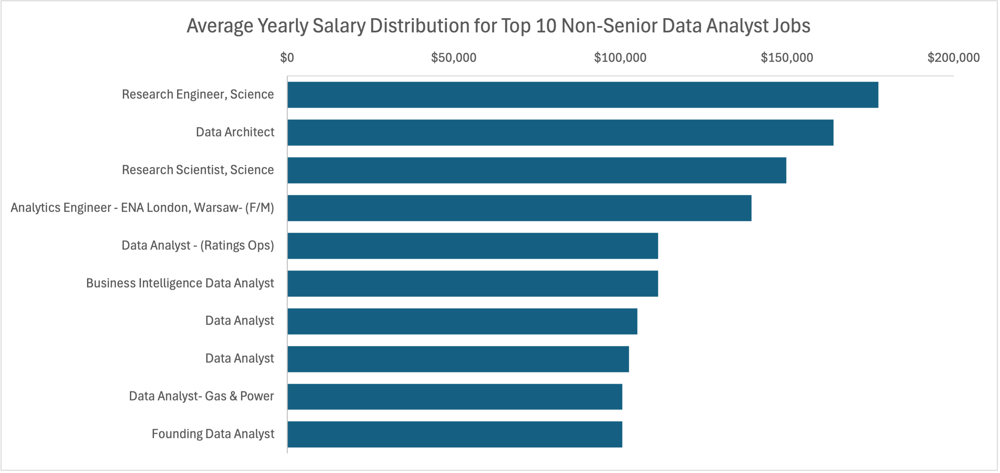
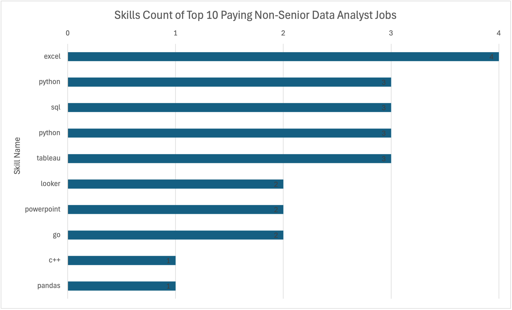

# Introduction
Build my data analytics study plan with me! By analysing data analyst job postings in the United Kingdom, this project dives into the top-paying Data Analyst jobs, in-demand skills, and top-paying skills. Finally, this project concludes with the most optimal skills (i.e., a skill both in demand and with a high salary) to learn as an aspiring Data Analyst.

This project was completed as part of Luke Barousse's course in [SQL for Data Analytics](https://www.youtube.com/watch?v=7mz73uXD9DA).

For the SQL queries, check them out here: [project_sql folder](/project_sql/)

<br>

# Background
Wanting to learn SQL for data analysis, I decided to complete Luke Barousse's course in [SQL for Data Analytics](https://www.youtube.com/watch?v=7mz73uXD9DA), gaining the knowledge of creating advanced SQL queries.

The dataset comes from Luke Barousse's course in [SQL for Data Analytics](https://www.youtube.com/watch?v=7mz73uXD9DA), and contains information on job titles, salaries, locations and skills.

### The questions I wanted to answer through my SQL queries were:

1. What are the top-paying non-Senior data analyst jobs in London?

2. What skills are required for these top-paying jobs?

3. What skills are most in demand for data analysts?

4. Which skills are associated with higher salaries?

5. What are the most optimal skills to learn?

<br> 

# Tools I Used
As part of this data analysis project, I used the following tools:

- **SQL**: The main tool I used to query the database and uncover insights on the current job market.
- **PostgreSQL**: The chosen database management system.
- **Excel**: The main tool used to create data visualisations and visualise insights.
- **Visual Studio Code**: The code editor to execute SQL queries.
- **Git & GitHub**: For version control and sharing my SQL analysis, allowing collaboration and project tracking.

<br>

# Analysis

Each query for this project looked at specific aspects of the data analyst job market.

### 1. Top Paying Non-Senior Data Analyst Roles in London

To find the highest-paying jobs, I filtered data analyst job positions to only show non-Senior roles in London, using CTEs. The following query demonstrates the high paying opportunities in the field for an aspiring data analyst.

```sql
-- CTE to find the jobs with any location in London, United Kingdom
WITH london_jobs AS(
    SELECT 
        job_id,
        job_location
    FROM
        job_postings_fact
    WHERE 
        job_location LIKE '%London%United_Kingdom%' 
        OR job_location lIKE '%London,_UK%'
)

-- Using CTE above, find the top 10 non-Senior 'Data Analyst' jobs with the highest salaries.
-- Showing which company posted those Top 10 paying jobs.
SELECT 
    jobs.job_id,
    company_dim.name AS company_name,
    jobs.job_title,
    jobs.job_title_short,
    jobs.job_location,
    jobs.job_schedule_type,
    jobs.salary_year_avg,
    jobs.job_posted_date
FROM 
    job_postings_fact AS jobs
    INNER JOIN london_jobs ON london_jobs.job_id = jobs.job_id
    LEFT JOIN company_dim ON company_dim.company_id = jobs.company_id
WHERE 
    job_title_short LIKE '%Data%Analyst'
    AND NOT job_title_short LIKE '%Senior%'
    AND salary_year_avg IS NOT NULL
ORDER BY
    salary_year_avg DESC
LIMIT 10;
```

Here's the breakdown of the top non-senior data analyst jobs in London:

- **Wide Salary Range**: The top 10 paying non-senior data analyst jobs in London have salaries above $100,000, with the highest paying job having a salary of over $175,000. As this is for non-senior roles, it indicates a potential increase of salary for senior positions.
- **Diverse Industries**: After researching the companies with the highest-paying non-senior roles, these companies belong to a variety of industries including AI research, online gaming, hospitality, etc.
- **Variety of Job Titles**: The top 10 paying data analyst jobs contain a variety of job titles found within the data analytics space, for example, 'Business Intelligence Data Analyst', 'Data Architect' or 'Research Scientist'.


*Bar graph visualising the top 10 non-senior data analyst jobs in London. Graph generated using Excel.*

### 2. Skills for Top Paying Jobs

To understand the skills required by the top 10 highest-paying jobs in London, I joined the dataset containing job postings with the dataset containing skills data, providing insights on the main skills valued by employers for high-salary roles.

``` sql
-- CTE to find the jobs in any location within London, United Kingdom
WITH london_jobs AS(
    SELECT 
        jobs.job_id,
        jobs.job_location
    FROM
        job_postings_fact AS jobs
    WHERE 
        jobs.job_location LIKE '%London%United_Kingdom%' 
        OR jobs.job_location lIKE '%London,_UK%'
),

-- CTE to find the top high-paying jobs in London, UK using CTE above
top_paying_jobs AS(
    SELECT 
        jobs.job_id,
        company_dim.name AS company_name,
        jobs.job_title,
        jobs.job_title_short,
        jobs.salary_year_avg
    FROM 
        job_postings_fact AS jobs
        INNER JOIN london_jobs ON london_jobs.job_id = jobs.job_id
        LEFT JOIN company_dim ON company_dim.company_id = jobs.company_id
    WHERE 
        job_title_short LIKE '%Data%Analyst'
        AND NOT job_title_short LIKE '%Senior%'
        AND salary_year_avg IS NOT NULL
    ORDER BY
        salary_year_avg DESC
    LIMIT 10
)

-- Using inner join to find the skills related to the top 10 highest-paying jobs in London
SELECT 
    top_paying_jobs.job_id,
    top_paying_jobs.company_name,
    top_paying_jobs.job_title_short,
    top_paying_jobs.salary_year_avg,
    skills_dim.skills AS skill_name
FROM 
    top_paying_jobs 
    INNER JOIN skills_job_dim ON skills_job_dim.job_id = top_paying_jobs.job_id
    INNER JOIN skills_dim ON skills_dim.skill_id = skills_job_dim.skill_id
ORDER BY
    salary_year_avg DESC;
```

Below is a breakdown of the most demanded skills for the top 10 highest paying non-senior data analyst jobs in London in 2023:
- **Excel** is leading with a count of 4.
- **Python, SQL and Tableau** follow closely with a count of 3.
- Other skills such as Looker, PowerPoint and Go are also sought after, with a count of 2.


*Bar graph visualising the count of skills required by the top 10 highest-paying non-senior data analyst roles. Graph generated using Excel.*

### 3. In-Demand Skills for Data Analysts

In this query we were able to identify the frequently requested skills in the job postings for data analyst positions (all levels) in the United Kingdom, to help us focus on skills with a high demand.

``` sql
-- CTE to find jobs in the UK
WITH uk_jobs AS(
    SELECT 
        job_id,
        job_location
    FROM
        job_postings_fact
    WHERE 
        job_location LIKE '%%United_Kingdom%' 
        OR job_location lIKE '%UK%'
)

-- Find the Top 5 skills requested in jobs in the United Kingdom
SELECT 
    skills_dim.skills,
    COUNT(skills_dim.skills) AS num_jobs_per_skill
FROM
    job_postings_fact AS jobs
    INNER JOIN uk_jobs ON uk_jobs.job_id = jobs.job_id
    INNER JOIN skills_job_dim ON skills_job_dim.job_id = jobs.job_id
    INNER JOIN skills_dim ON skills_dim.skill_id = skills_job_dim.skill_id
WHERE
    jobs.job_title_short = 'Data Analyst'
GROUP BY 
    skills_dim.skills
ORDER BY
    num_jobs_per_skill DESC
LIMIT 5;
```

Below is the breadown of the most demanded skills for data analysts:

- **SQL** and **Excel** are the top skills required in job postings for data analyst positions. This emphasises the need for strong foundation skills in data processing and spreadsheet manipulation.
- **Programming** and **Visualisation Tools** like **Power BI**, **Python**, and **Tableau**, follow next, showing an importance on having knowledge of techniques in data storytelling.

| Skills   | Demand Count |
| -------- | ------------ |
| SQL      | 4011         |
| Excel    | 3909         |
| Power BI | 2604         |
| Python   | 1877         |
| Tableau  | 1463         |

*Table of the demand count for the Top 5 skills requested in data analyst job postings.*

### 4. Skills Based On Salary

Exploring the skills that are associated to the job postings with the highest salary to understand which skills are the highest paying in the United Kingdom. Looked at skills that appeared in more than 5 job postings.

``` sql
-- CTE to find jobs in the UK
WITH uk_jobs AS(
    SELECT 
        job_id,
        job_location
    FROM
        job_postings_fact
    WHERE 
        job_location LIKE '%%United_Kingdom%' 
        OR job_location lIKE '%UK%'
)

-- Find the skills with the highest salary, with the skill needing to appear in more than 5 job postings
SELECT 
    skills_dim.skills,
    COUNT(skills_dim.skills) AS num_jobs_per_skill,
    ROUND(AVG(jobs.salary_year_avg)) AS avg_salary
FROM
    job_postings_fact AS jobs
    INNER JOIN uk_jobs ON uk_jobs.job_id = jobs.job_id
    INNER JOIN skills_job_dim ON skills_job_dim.job_id = jobs.job_id
    INNER JOIN skills_dim ON skills_dim.skill_id = skills_job_dim.skill_id
WHERE
    jobs.job_title_short = 'Data Analyst'
    AND jobs.salary_year_avg IS NOT NULL
GROUP BY 
    skills_dim.skills
HAVING
    COUNT(skills_dim.skills) > 5
ORDER BY
    avg_salary DESC
LIMIT 10;
```

Here's a breakdown of the results for top paying skills for data analysts:

- **Cloud Computing Expertise**: Knowledge in cloud computing tools (Azure, Go) is highly sought after by high-paying data analyst roles, showing the growing importance of cloud-based analytics environments.
- **Data Visualisation and Data Processing Tools**: Many data visualisation tools (Looker, Power BI, Tableau) and data processing tools (SQL, Excel) have high salaries associated to them, showing an importance on good data visualisation and data processing techniques for better decision making.
- **Machine Learning and Statistical Tools**: Having knowledge in machine learning tools (Python) and statistical tools (R, SAS) show the importance of having predictive modeling capabilities as a data analyst.

| Skills     | Average Salary ($)  |
| :---------:| :------------------:|
| azure      | 110,922             |
| looker     | 100,969             |
| python     | 92,402              |
| power bi   | 90,256              |
| r          | 88,526              |
| sql        | 87,156              |
| excel      | 83,362              |
| tableau    | 82,079              |
| sas        | 80,551              |
| go         | 74,905              |

*Table of the average salary for the Top 10 paying skills for data analysts.*

### 5. Most Optimal Skills to Learn

Using insights from demand and salary data, we found the optimal skills that are both in high demand and have high salaries, offering a strategic focus for skill development.

```sql
-- CTE to find jobs in the UK
WITH uk_jobs AS(
    SELECT 
        job_id,
        job_location
    FROM
        job_postings_fact
    WHERE 
        job_location LIKE '%%United_Kingdom%' 
        OR job_location lIKE '%UK%'
), 

-- CTE to find most in-demand skills in the United Kingdom
in_demand_skills AS(
    SELECT 
        skills_dim.skill_id,
        skills_dim.skills,
        COUNT(skills_dim.skills) AS num_jobs_per_skill
    FROM
        job_postings_fact AS jobs
        INNER JOIN uk_jobs ON uk_jobs.job_id = jobs.job_id
        INNER JOIN skills_job_dim ON skills_job_dim.job_id = jobs.job_id
        INNER JOIN skills_dim ON skills_dim.skill_id = skills_job_dim.skill_id
    WHERE
        jobs.job_title_short = 'Data Analyst'
        AND jobs.salary_year_avg IS NOT NULL
    GROUP BY 
        skills_dim.skill_id
),

-- CTE to find top high-paying jobs in the United Kingdom
high_paying_skills AS(
    SELECT 
        skills_dim.skill_id,
        skills_dim.skills,
        ROUND(AVG(jobs.salary_year_avg)) AS avg_salary
    FROM
        job_postings_fact AS jobs
        INNER JOIN uk_jobs ON uk_jobs.job_id = jobs.job_id
        INNER JOIN skills_job_dim ON skills_job_dim.job_id = jobs.job_id
        INNER JOIN skills_dim ON skills_dim.skill_id = skills_job_dim.skill_id
    WHERE
        jobs.job_title_short = 'Data Analyst'
        AND jobs.salary_year_avg IS NOT NULL
    GROUP BY 
        skills_dim.skill_id
)

-- Finding most optimal skills within the United Kingdom
SELECT 
    in_demand_skills.skill_id,
    in_demand_skills.skills,
    in_demand_skills.num_jobs_per_skill,
    high_paying_skills.avg_salary
FROM 
    in_demand_skills
    INNER JOIN high_paying_skills ON high_paying_skills.skill_id = in_demand_skills.skill_id
ORDER BY
    in_demand_skills.num_jobs_per_skill DESC,
    high_paying_skills.avg_salary DESC
LIMIT 10;
```

| Skill ID    | Skills   | Demand Count    | Average Salary ($)  |
| :---------: | :-------:|:---------------:| :------------------:|
| 0           | sql      |33               | 87,156              |
| 181         | excel    |29               | 83,362              |
| 1           | python   |24               | 92,402              |
| 182         | tableau  |13               | 82,079              |
| 5           | r        |9                | 88,526              |
| 8           | go       |9                | 74,905              |
| 183         | power bi |7                | 90,256              |
| 74          | azure    |6                | 110,922             |
| 185         | looker   |6                | 100,969             |
| 198         | outlook  |6                | 57,788              |


*Table of the most optimal skills for data analysts in the United Kingdom sorted by demand count and average salary.*

Below is a breakdown of the most optimal skills for data analysts in the United Kingdom:
- **High Demand for Programming Languages**: Programming languages such as Python and R are within the top 10 optimal skills as a data analyst in the United Kingdom, with counts of 24 and 9 respectively. Their high salaries rounded to $90,000 suggest that they are valued skills in many industries.
- **Data Visualisation and Business Intelligence**: Tableau, Power PI and Looker are tools required by many employers with salaries above $80,000, suggesting the importance of data visualisation techniques for data analysts to provide actionable insights from data to companies.
- **Database Technologies**: SQL and Excel, tools used for data management, are also popular between employers, with demand counts being 33 and 29 respectively. Furthermore, their salaries above $80,000 suggest the need of data analysts for data management and data retrieval.  

<br>

# What I Learned

Througout this course and project, I've built my knowledge in SQL such as:

- **Advanced SQL**: Learnt about CTEs, sub-queries, and joins to merge tables and uncover insights from large datasets.
- **Data Aggregation**: Learnt to use aggregate functions like COUNT() and AVG() with GROUP BY to summarise data quickly.
- **Analytical skills**: Improved my problem-solving skills by answering questions using SQL queries to uncover actionable insights from data.

# Conclusions

### Insights

From the analysis, we uncovered the following insights:

1. **Top-Paying Non-Senior Data Analyst Jobs in London**: The highest-paying non-senior jobs for data analysts have a wide range of salaries starting over $100,000.
2. **Skills for Top-Paying Jobs**: The skill highly sought by employers for high-paying job roles is Excel, showing the importance of having knowledge in data manipulation and data visualisation.
3. **Most In-Demand Skills**: SQL is the most in-demand skill looked by employers for data analyst positons, making it an essential skill for aspiring data analysts.
4. **Skills with the Highest Salaries**: 
